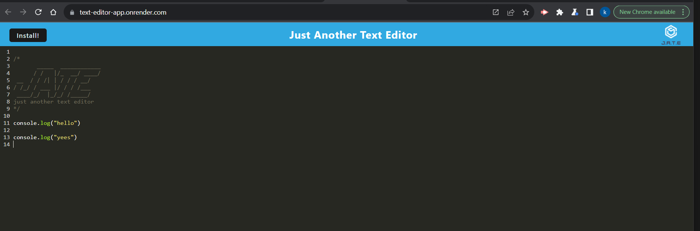
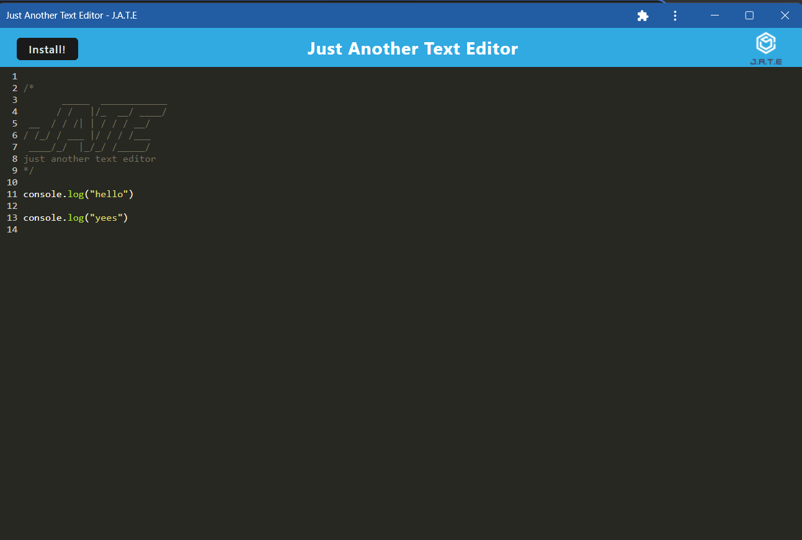

# Text-Editor

 
  

## Description
📙 Text-Editor is a single page app, Which runs in browser as well as online.  It features a number of data persistence techniques that serve as redundancy in case one of the options is not supported by the browser.

## Table of Contents
- [Description](#description)
- [Installation](#installation)
- [Usage](#usage)
- [License](#license)
- [Contributing](#contributing)

## Installation

⚙️ Clone Repo

⚙️ Npm I

⚙️ npm start 

## Usage

💻 Deployed URL:

https://text-editor-app.onrender.com/ 

## Mock-up

Offline:

## License

 

This application is covered by the MIT license. 

## Contributing

Used mini project as reference